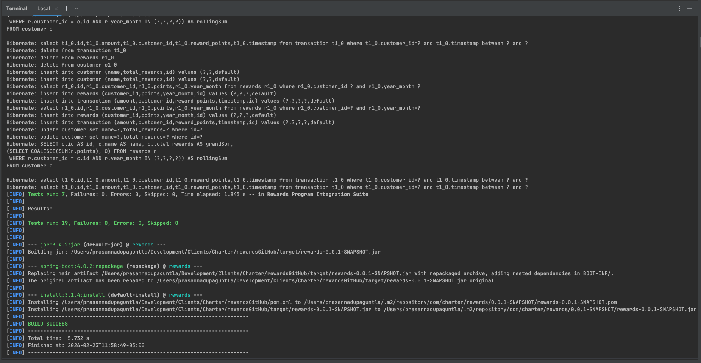
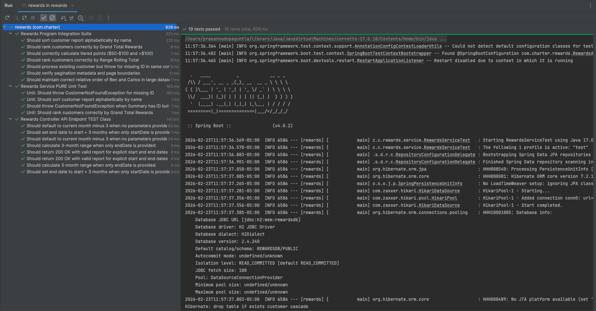
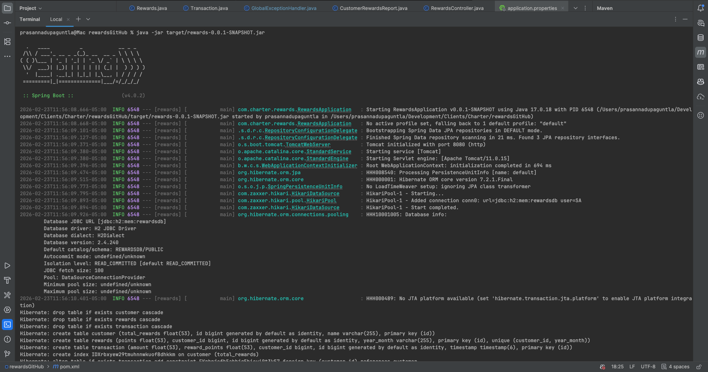
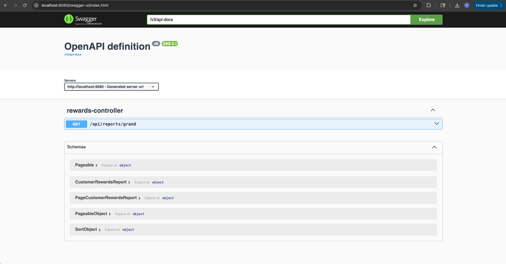
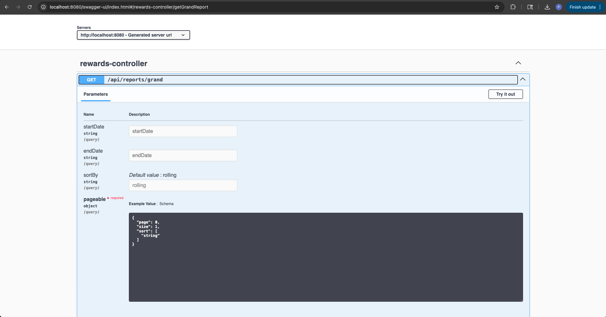

# Charter Rewards - Spring Boot Application

## Requirements : 
* A customer receives 2 points for every dollar spent over $100 in each transaction, plus 1 point for every dollar spent between $50 and $100 in each transaction (ex : a $120 purchase = 2*$20 + 1*$50 = 90 points)
* Given a record of every transaction for a given date range, ( if no date range is provided then last 3 months ) period,  calculate the reward points earned for each customer per month and total
* Start and End date format is yyyy-MM
* Solve using Spring Boot
* Create a RESTful endpoint

## Tech Stack
* Java 17 
* Spring Boot
* Spring Data JPA 
* JUnit / Mockito

## How to compile and run
* mvn clean install [install-screenshot](docs/Screenshot-compile.png)
* java -jar target/rewards-0.0.1-SNAPSHOT.jar [run-screenshot](docs/Screenshot-run.png)
* Open http://localhost:8080/api/reports/grand?sortBy=rolling&size=10 in the browser

## Swagger UI (Interactive) end point
* http://localhost:8080/swagger-ui/index.html
## JSON Open API Spec end point
* http://localhost:8080/v3/api-docs

## end points
* api/grand report with date range 2025-09 to 2026-01
  *  http://localhost:8080/api/reports/grand?startDte=2025-09&endDate=2026-01&sortBy=name,desc
* api/grand : last 3 month report with reward points earned and grand total with page size 5
  * http://localhost:8080/api/reports/grand?sortBy=name&size=5
  * http://localhost:8080/api/reports/grand?sortBy=name&page=1&size=5
  * http://localhost:8080/api/reports/grand?&sortBy=name&page=2&size=5
  * and so on 

## [Click this link for Results](docs/results.json)

---

## Screenshots
* [compile](docs/Screenshot-compile.png)
  
* [tests](docs/Screenshot-tests.png)
   
* [run](docs/Screenshot-run.png)
  
* [swagger ui - main page](docs/Screenshot-swagger-ui.png)
  
* [swagger ui with API grand](docs/Screenshot-swagger-ui-grand.png)
  

---

## Sample input Data
### Customer 
| ID  | NAME | TOTAL\_REWARDS |
| --- | --- | --- |
| 1 | Jannik Sinner | 1671.32 |
| 2 | Carlos Alcaraz | 1572.53 |
| 3 | Novak Djokovic | 1483.45 |
| 4 | Rafael Nadal | 1368.74 |
| 5 | Roger Federer | 1516.61 |
| 6 | Ben Shelton | 1169.81 |
| 7 | Rybakina | 1547.35 |
| 8 | Swiatek | 1302.57 |
| 9 | Gauff | 2181.08 |
| 10 | Karolína | 1022.41 |

### Sample Transaction data
|ID | CUSTOMER\_ID | TIME | AMOUNT | POINTS |
| -- | --- | --- | --- | --- |
| 1 | 1 | 2025-09-27 16:18:50 | 117.46 | 84.92 |
| 2 | 1 | 2025-08-23 21:18:50 | 177.01 | 204.02 |
| 3 | 1 | 2025-12-28 01:18:50 | 190.99 | 231.98 |
| 4 | 1 | 2026-01-26 07:18:50 | 188.83 | 227.66 |
| 5 | 1 | 2026-01-21 18:18:50 | 198.69 | 247.38 |
| 6 | 1 | 2025-10-13 14:18:50 | 185.16 | 220.32 |
| 7 | 1 | 2025-08-30 18:18:50 | 133.35 | 116.7 |
| 8 | 1 | 2026-02-08 19:18:50 | 158.84 | 167.68 |
| 9 | 1 | 2025-08-21 13:18:50 | 44.65 | 0.0 |
| 10 | 1 | 2025-12-27 14:18:50 | 68.79 | 18.79 |
| 11 | 1 | 2026-01-27 21:18:50 | 189.11 | 228.22 |
| 12 | 1 | 2025-09-07 02:18:50 | 66.35 | 16.35 |
| 13 | 1 | 2025-10-28 19:18:50 | 145.22 | 140.44 |
| 14 | 1 | 2025-12-04 13:18:50 | 33.22 | 0.0 |
| 15 | 1 | 2025-10-12 20:18:50 | 116.44 | 82.88 |
| 16 | 2 | 2025-11-13 07:18:50 | 83.72 | 33.72 |
| 17 | 2 | 2025-10-15 20:18:50 | 96.08 | 46.08 |
| 18 | 2 | 2025-12-04 14:18:50 | 89.98 | 39.98 |
| 19 | 2 | 2025-11-14 23:18:50 | 112.17 | 74.34 |
| 20 | 2 | 2025-12-05 01:18:50 | 52.98 | 2.98 |
| 21 | 2 | 2025-11-06 12:18:50 | 36.79 | 0.0 |
| 22 | 2 | 2025-09-16 18:18:50 | 154.03 | 158.06 |
| 23 | 2 | 2025-10-01 09:18:50 | 154.11 | 158.22 |
| 24 | 2 | 2025-11-06 03:18:50 | 121.14 | 92.28 |
| 25 | 2 | 2025-12-05 02:18:50 | 63.79 | 13.79 |
| 26 | 2 | 2026-01-16 19:18:50 | 92.24 | 42.24 |
| 27 | 2 | 2025-11-14 11:18:50 | 41.26 | 0.0 |
| 28 | 2 | 2025-10-07 15:18:50 | 102.36 | 54.72 |
| 29 | 2 | 2025-10-31 18:18:50 | 184.75 | 219.5 |
| 30 | 2 | 2025-11-16 18:18:50 | 175.23 | 200.46 |
| 31 | 3 | 2025-09-09 14:18:50 | 169.54 | 189.08 |
| 32 | 3 | 2025-12-30 13:18:50 | 80.62 | 30.62 |
| 33 | 3 | 2026-01-22 19:18:50 | 193.35 | 236.7 |
| 34 | 3 | 2025-12-02 08:18:50 | 47.38 | 0.0 |
| 35 | 3 | 2026-01-15 20:18:50 | 63.62 | 13.62 |
| 36 | 3 | 2025-10-31 16:18:50 | 48.95 | 0.0 |
| 37 | 3 | 2025-11-08 01:18:50 | 76.22 | 26.22 |
| 38 | 3 | 2025-09-04 08:18:50 | 152.28 | 154.56 |
| 39 | 3 | 2025-11-24 23:18:50 | 57.47 | 7.47 |
| 40 | 3 | 2025-12-14 17:18:50 | 163.45 | 176.9 |
| 41 | 3 | 2025-09-20 19:18:50 | 76.06 | 26.06 |
| 42 | 3 | 2025-10-24 10:18:50 | 73.18 | 23.18 |
| 43 | 3 | 2025-11-05 00:18:50 | 169.16 | 188.32 |
| 44 | 3 | 2026-02-11 01:18:50 | 173.31 | 196.62 |
| 45 | 3 | 2025-09-24 13:18:50 | 87.53 | 37.53 |
| 46 | 4 | 2025-11-10 08:18:50 | 190.9 | 231.8 |
| 47 | 4 | 2025-10-04 00:18:50 | 117.64 | 85.28 |
| 48 | 4 | 2026-02-07 17:18:50 | 30.19 | 0.0 |
| 49 | 4 | 2025-10-05 14:18:50 | 145.03 | 140.06 |
| 50 | 4 | 2025-10-19 20:18:50 | 183.68 | 217.36 |
| 51 | 4 | 2026-01-03 09:18:50 | 51.93 | 1.93 |
| 52 | 4 | 2025-10-25 12:18:50 | 152.95 | 155.9 |
| 53 | 4 | 2025-12-04 01:18:50 | 64.02 | 14.02 |
| 54 | 4 | 2025-08-29 07:18:50 | 176.42 | 202.84 |
| 55 | 4 | 2026-02-04 21:18:50 | 75.58 | 25.58 |
| 56 | 4 | 2025-12-05 03:18:50 | 36.26 | 0.0 |
| 57 | 4 | 2025-11-10 08:18:50 | 79.9 | 29.9 |
| 58 | 4 | 2026-01-14 10:18:50 | 188.87 | 227.74 |
| 59 | 4 | 2025-12-26 12:18:50 | 91.64 | 41.64 |
| 60 | 4 | 2025-09-01 08:18:50 | 53.95 | 3.95 |
| 61 | 5 | 2025-10-14 11:18:50 | 121.12 | 92.24 |
| 62 | 5 | 2025-10-15 23:18:50 | 35.06 | 0.0 |
| 63 | 5 | 2025-12-03 17:18:50 | 176.12 | 202.24 |
| 64 | 5 | 2025-10-29 03:18:50 | 130.73 | 111.46 |
| 65 | 5 | 2025-11-16 04:18:50 | 155.52 | 161.04 |
| 66 | 5 | 2026-02-12 01:18:50 | 168.78 | 187.56 |
| 67 | 5 | 2026-01-30 13:18:50 | 30.24 | 0.0 |
| 68 | 5 | 2026-02-02 14:18:50 | 48.16 | 0.0 |
| 69 | 5 | 2025-12-29 13:18:50 | 181.69 | 213.38 |
| 70 | 5 | 2025-10-04 23:18:50 | 102.11 | 54.22 |
| 71 | 5 | 2025-10-05 02:18:50 | 184.3 | 218.6 |
| 72 | 5 | 2025-10-10 11:18:50 | 73.3 | 23.3 |
| 73 | 5 | 2025-11-29 07:18:50 | 179.23 | 208.46 |
| 74 | 5 | 2026-01-23 04:18:50 | 77.03 | 27.03 |
| 75 | 5 | 2025-10-24 00:18:50 | 188.53 | 227.06 |
| 76 | 6 | 2025-09-16 20:18:50 | 131.16 | 112.32 |
| 77 | 6 | 2025-12-31 12:18:50 | 34.69 | 0.0 |
| 78 | 6 | 2025-09-29 08:18:50 | 152.04 | 154.08 |
| 79 | 6 | 2026-01-29 18:18:50 | 118.87 | 87.74 |
| 80 | 6 | 2025-11-18 02:18:50 | 34.34 | 0.0 |
| 81 | 6 | 2025-12-26 13:18:50 | 182.13 | 214.26 |
| 82 | 6 | 2025-12-08 07:18:50 | 88.75 | 38.75 |
| 83 | 6 | 2025-11-05 09:18:50 | 37.81 | 0.0 |
| 84 | 6 | 2025-10-21 13:18:50 | 95.77 | 45.77 |
| 85 | 6 | 2026-02-11 20:18:50 | 170.11 | 190.22 |
| 86 | 6 | 2025-08-21 16:18:50 | 65.51 | 15.51 |
| 87 | 6 | 2025-09-28 14:18:50 | 83.39 | 33.39 |
| 88 | 6 | 2025-10-03 09:18:50 | 133.22 | 116.44 |
| 89 | 6 | 2026-01-04 10:18:50 | 58.98 | 8.98 |
| 90 | 6 | 2025-09-23 14:18:50 | 77.9 | 27.9 |
| 91 | 7 | 2025-12-12 03:18:50 | 161.56 | 173.12 |
| 92 | 7 | 2025-08-27 06:18:50 | 186.31 | 222.62 |
| 93 | 7 | 2025-09-29 01:18:50 | 75.22 | 25.22 |
| 94 | 7 | 2025-11-20 11:18:50 | 178.27 | 206.54 |
| 95 | 7 | 2025-12-11 18:18:50 | 129.76 | 109.52 |
| 96 | 7 | 2025-10-08 22:18:50 | 189.73 | 229.46 |
| 97 | 7 | 2026-01-07 10:18:50 | 111.94 | 73.88 |
| 98 | 7 | 2025-11-30 22:18:50 | 179.06 | 208.12 |
| 99 | 7 | 2025-12-03 12:18:50 | 42.17 | 0.0 |
| 100 | 7 | 2025-09-01 18:18:50 | 138.49 | 126.98 |
| 101 | 7 | 2025-11-24 23:18:50 | 197.02 | 244.04 |
| 102 | 7 | 2025-10-27 11:18:50 | 37.08 | 0.0 |
| 103 | 7 | 2025-11-07 10:18:50 | 69.35 | 19.35 |
| 104 | 7 | 2026-01-21 12:18:50 | 113.7 | 77.4 |
| 105 | 7 | 2026-02-01 17:18:50 | 33.14 | 0.0 |
| 106 | 8 | 2026-01-08 11:18:50 | 138.6 | 127.2 |
| 107 | 8 | 2026-01-03 06:18:50 | 87.71 | 37.71 |
| 108 | 8 | 2026-02-16 05:18:50 | 89.96 | 39.96 |
| 109 | 8 | 2025-12-04 17:18:50 | 176.15 | 202.3 |
| 110 | 8 | 2026-01-04 06:18:50 | 67.36 | 17.36 |
| 111 | 8 | 2025-12-31 09:18:50 | 166.66 | 183.32 |
| 112 | 8 | 2025-11-24 07:18:50 | 167.71 | 185.42 |
| 113 | 8 | 2026-02-06 18:18:50 | 151.02 | 152.04 |
| 114 | 8 | 2025-11-07 07:18:50 | 90.26 | 40.26 |
| 115 | 8 | 2025-12-10 22:18:50 | 163.73 | 177.46 |
| 116 | 8 | 2025-11-17 20:18:50 | 46.56 | 0.0 |
| 117 | 8 | 2025-08-25 21:18:50 | 66.9 | 16.9 |
| 118 | 8 | 2025-12-23 16:18:50 | 117.97 | 85.94 |
| 119 | 8 | 2025-10-17 13:18:50 | 80.55 | 30.55 |
| 120 | 8 | 2025-10-19 12:18:50 | 168.11 | 186.22 |
| 121 | 9 | 2025-12-25 02:18:50 | 95.38 | 45.38 |
| 122 | 9 | 2025-11-30 16:18:50 | 120.17 | 90.34 |
| 123 | 9 | 2025-09-20 08:18:50 | 155.09 | 160.18 |
| 124 | 9 | 2025-10-20 02:18:50 | 199.18 | 248.36 |
| 125 | 9 | 2025-12-27 21:18:50 | 38.61 | 0.0 |
| 126 | 9 | 2026-02-16 03:18:50 | 67.69 | 17.69 |
| 127 | 9 | 2025-11-12 16:18:50 | 47.93 | 0.0 |
| 128 | 9 | 2025-09-25 14:18:50 | 89.02 | 39.02 |
| 129 | 9 | 2025-12-16 14:18:50 | 66.33 | 16.33 |
| 130 | 9 | 2025-11-14 02:18:50 | 66.22 | 16.22 |
| 131 | 9 | 2026-02-15 15:18:50 | 92.89 | 42.89 |
| 132 | 9 | 2025-09-10 11:18:50 | 136.32 | 122.64 |
| 133 | 9 | 2025-10-18 14:18:50 | 173.4 | 196.8 |
| 134 | 9 | 2025-10-13 21:18:50 | 198.82 | 247.64 |
| 135 | 9 | 2026-01-02 15:18:50 | 145.06 | 140.12 |
| 136 | 10 | 2025-08-24 18:18:50 | 114.67 | 79.34 |
| 137 | 10 | 2025-09-11 00:18:50 | 32.0 | 0.0 |
| 138 | 10 | 2026-01-05 23:18:50 | 146.98 | 143.96 |
| 139 | 10 | 2025-10-18 09:18:50 | 101.32 | 52.64 |
| 140 | 10 | 2025-09-13 04:18:50 | 97.32 | 47.32 |
| 141 | 10 | 2025-10-01 12:18:50 | 105.05 | 60.1 |
| 142 | 10 | 2025-10-29 02:18:50 | 62.51 | 12.51 |
| 143 | 10 | 2025-09-14 22:18:50 | 91.39 | 41.39 |
| 144 | 10 | 2025-11-28 19:18:50 | 54.77 | 4.77 |
| 145 | 10 | 2026-01-06 20:18:50 | 169.97 | 189.94 |
| 146 | 10 | 2025-11-06 21:18:50 | 124.84 | 99.68 |
| 147 | 10 | 2025-10-31 08:18:50 | 79.68 | 29.68 |
| 148 | 10 | 2026-01-11 00:18:50 | 101.21 | 52.42 |
| 149 | 10 | 2025-11-10 19:18:50 | 114.32 | 78.64 |
| 150 | 10 | 2025-10-24 20:18:50 | 171.12 | 192.24 |

---
